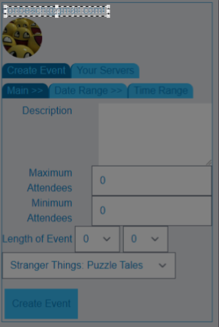
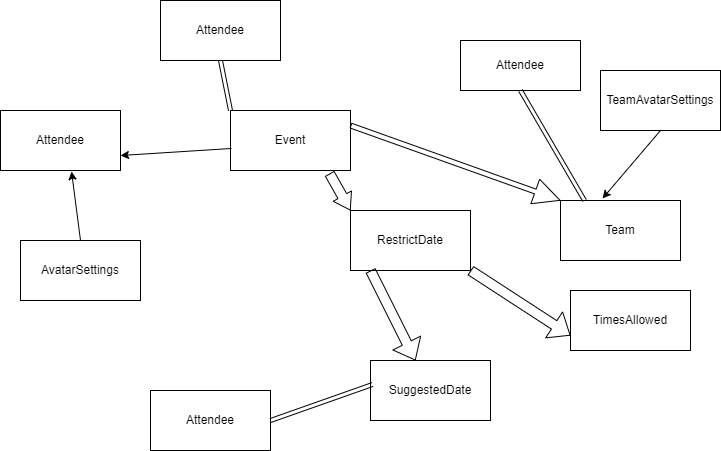

 
<h1 align = "center">
<b> Blazor Meetup</b>
</h1>

This application lets a user create events which others can join

 Debuted 12.6 2021 

Matthew
 

--------------------

## 📖  Description

This is a multiuser event application. The application lets users create events with a date and time which users can then join. In addition the user who creates an event may specify days and hours that other users may suggest as the preferred date. Event creators can select an official date and time from the suggested dates and times. Events may also divide it's attendees into teams. The event creator can decide who goes on which team and attendees can watch in real time as users are selected to a team. Teams may also have there own avatar to represent them.

All users login via Discord and each event is associated with a Discord channel. 
Users may find created events by going to the Server tab and selecting a discord server. Most of the app exists in a single web route with an embedded hierarchy of tabs.

--------------------

## 🛠️ Technologies Used

This project uses the following technologies:

- C# v9.0
- .NET Core v5.0
- ASP .NET Blazor Server Side (with Razor based Identity scaffolding)
- Javascript - which is called from Blazor server via the JSInterop.
- Entity Framework Core - MySQL
- Oauth2 - all identity (signin/users/avatars) is via Discord
- Docker
- ClamAV Anti-Virus Scanner (As a docker container)
- Tailwind (A CSS framework)
- Node (For Tailwind)
- HTML 5 Drag and Drop API
- Azure for hosting and deployment
- Microsoft SQL Server on Azure (MySql for local development)
-------------------

## 🔧 Blazor Meetup Implementation

|Name| Function | Implementation |
| :------------- | :------------- | :------------- |
|Teams | Lets Event Users Sort Teams In real Time | Takes advantage of Event subscriptions |
| Discord Login | Identity, Login and Avatars are from Discord  | Oauth2 |
| Styling | CSS Framework | Tailwind |
| Avatars| Event creators can upload Team avatars  | ClamAV is used to detect viruses when a user uploads an image |
| Server Event Lists | Server Events Lists show each event available to a user  | Limit events to upcoming events  |
|  |  |  |
-------------------

## ✅ Todo List

|Name| Function | Implementation |
| :------------- | :------------- | :------------- |
|Tabs | Let's users navigate the app | Change Color of Tab to indicate it's disabled |
| List of who is available for a certain date | Identity, Login and Avatars are from Discord  |Suggested dates list should use avatars that show names on hover.|
|Team Avatars| Event creators can upload Team avatars  | ClamAV is used to detect viruses when a user uploads an image |
| Avatar Tabs|tab are used to navigate the app  | add a tab specifically for avatar uploading |
| Server Avatars | Avatars used by a Discord server  |  Show avatar of server in the servers list. |
| nix multiple restrict date | Restrict Dates are required so that users can suggest times for those dates  | make it so you can’t have multiple restrict dates for the same day. |
-------------------

## 🔮 Future Vision

|Name| Function | Implementation |
| :------------- | :------------- | :------------- |
|Date ranges | Dates let users know when an event occurs | automatically supply available dates when given a range of dates|
| Attendee Limit | Some event have a maximum or minimum capacity of users |Dont let more attendees attend after maximum attendees reached or dont enable event unless minimum attendees has been reached|
| Server List   | Server lists help users find events related to a server they are a part of |Servers have an indicator that they can be searched such as a caret symbol that turns when clicked on.|

-------------------

## 🔧 Setup & Requirements

#### To run this project locally you will need:

- **ASP .NET Core :** You can check if you have .NET Core by running `dotnet --version` in the command line. If you do not have .NET Core please find more information and download [here](https://dotnet.microsoft.com/download/dotnet-core)
- **Tailwind :**  https://tailwindcss.com/
- **NPM/NODE :** https://nodejs.org/en/
- **Docker :**  https://docs.docker.com/get-docker/
- **ClamAV Docker Container :** https://hub.docker.com/r/clamav/clamav
- **MySQl Community Edition:** https://www.mysql.com/products/community/
- **Or Microsoft SQL Server Express:**  https://www.microsoft.com/en-us/download/details.aspx?id=101064
#### To Download:

New: Go to the sql server branch to get the version setup for microsoft sql server. (git checkout sqlserver)

Warning about the Docker container: Hosting a docker container on Azure can be very expensive in my experience, so keep that in mind.

You will need to have node installed to use tailwind.
Once you have node installed, use a command line terminal to navigate to the folder described in step one and type `npm install`.

Go to my GitHub repository here, [https://github.com/OkilyDokily/BlazorMeetup](https://github.com/OkilyDokily/BlazorMeetup), and click on the green 'Code' button to clone the repository, Open with GitHub Desktop OR Download the ZIP file
Alternatively, If you have Git Bash installed type the command `git clone https://github.com/OkilyDokily/BlazorMeetup` to download.

You will need to have MySql or another database installed with the correct connection string and then run migrations before starting the application. After you run migrations you need to update the database.

1. in the application folder run `dotnet ef migrations add first`
2. then run `dotnet ef database update`

 In addition after you update the database, you will need to run a script on the database to remove all of the foreign key constraints (this makes the app run properly). The script is at the bottom of the README, and you may need to adjust the script according to which database you use. The script is specifically written for microsoft sql server. 

#### Running/viewing application:

1. Once you have opened the code in your preferred text editor you will need to navigate to the 'BlazorMeetup/BlozorMeetup' folder (`cd BlazorMeetup`) in the command line and run `dotnet run` or `dotnet watch run`.
2. At this point you should be able to click on the link to the local server's url path to view the compiled project. 

--------------------------

## 📫 Support and contact details

For support or other issues contact me @ [email](mailto:ironbeach@gmail.com).

---------------------------

## 📜 SQL Script
while(exists(select 1 from INFORMATION_SCHEMA.TABLE_CONSTRAINTS where CONSTRAINT_TYPE='FOREIGN KEY'))

begin

 declare @sql nvarchar(2000)

 SELECT TOP 1 @sql=('ALTER TABLE ' + TABLE_SCHEMA + '.[' + TABLE_NAME

 + '] DROP CONSTRAINT [' + CONSTRAINT_NAME + ']')

 FROM information_schema.table_constraints

 WHERE CONSTRAINT_TYPE = 'FOREIGN KEY'

 exec (@sql)

 PRINT @sql

end
https://intellipaat.com/community/8183/how-to-drop-all-tables-and-reset-an-azure-sql-database
## 📊 SQL Schema

Copyright (c) 2021 Matthew LeDoux.
